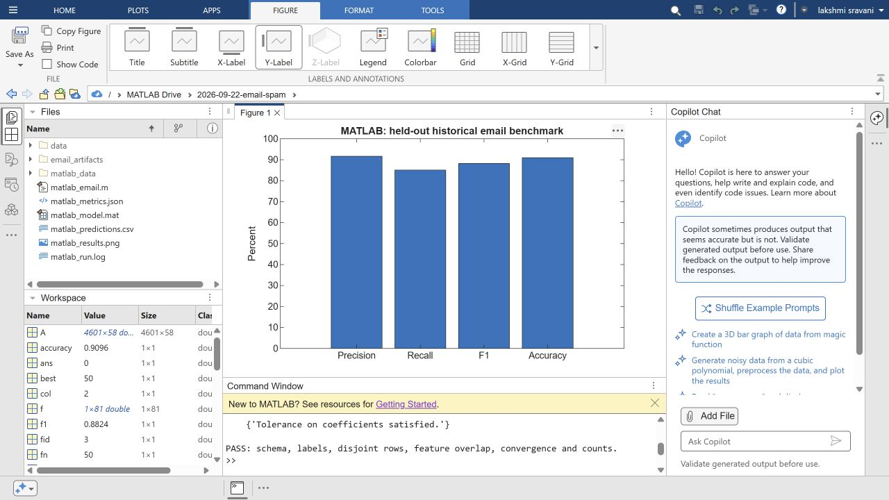
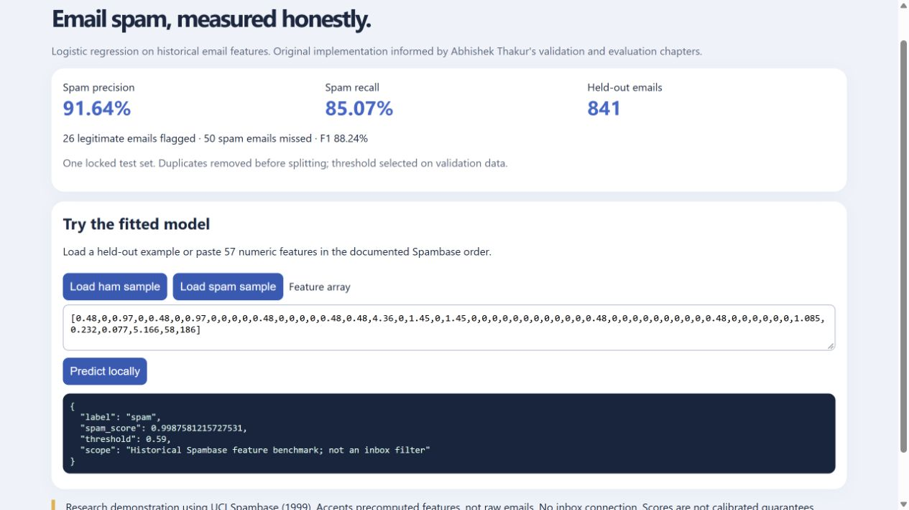

# Email spam benchmark: Python + MATLAB

Historical email-feature classification in Python and MATLAB. Run on September 22, 2026 (Python, and MATLAB Online R2026a Update 5); the Python side was then retrained from scratch in a clean environment on Python 3.13.5 with the pinned requirements, reproducing every metric exactly. This is a local research demo, not a modern inbox filter.

## Results

Both implementations produced the same confusion matrix on the same 841 held-out source rows: **480 true negatives, 26 false positives, 50 false negatives, 285 true positives**. Model solvers are separate; identical class counts do not imply identical probability scores or prediction-by-prediction parity.

| Measure | Python | MATLAB | Always-ham baseline |
|---|---:|---:|---:|
| Precision | 91.64% | 91.64% | 0% |
| Recall | 85.07% | 85.07% | 0% |
| F1 | 88.24% | 88.24% | 0% |
| Accuracy | 90.96% | 90.96% | 60.17% |

The Python conditional bootstrap F1 interval is 85.71%–90.82%. Source and time shifts are outside this interval's scope. Both thresholds were chosen on validation data and equal 0.59 (MATLAB prints 0.59000000000000008). All 11 Python tests passed (6 for the email benchmark, 5 for the earlier SMS benchmark). MATLAB's native assertions passed; its optimizer reported “Tolerance on coefficients satisfied.” The MATLAB figures above are copied from its Command Window output (`email_artifacts/matlab-observed-output.txt`); the native `matlab_metrics.json` is not committed.

**How much depends on the split.** The table uses one split (seed 42). Rerunning the same pipeline on 20 other random splits (`seed_spread.py`, output in `email_artifacts/seed_spread.json`): accuracy 89.06–92.98% (mean 91.18%), spam recall 76.72–89.85% (mean 84.70%), F1 84.96–90.96% (mean 88.41%), and the validation-chosen threshold ranges from 0.39 to 0.71. The always-ham baseline stays at 60.17%. Seed 42 is close to the average, not a lucky split, but recall in particular can swing by more than ten points.

## Screenshots

Native MATLAB Online R2026a run of `matlab_email.m`: held-out metrics chart and the passing assertion line in the Command Window:



Local Python demo (`python serve.py`) predicting a held-out spam sample:



## Run Python

From this project directory (verified on Python 3.13.5):

```powershell
python -m venv .venv
.venv/Scripts/python -m pip install -r requirements.txt
.venv/Scripts/python email_project.py train
.venv/Scripts/python -m unittest -v
.venv/Scripts/python seed_spread.py
.venv/Scripts/python serve.py
```

Open http://127.0.0.1:8765 and choose a sample, then Predict locally. The service binds only to loopback. It accepts 57 precomputed features in `email_artifacts/feature_names.json` order. It does not parse raw email. Stop with Ctrl+C. Only load trusted joblib artifacts.

## Run MATLAB

Use MATLAB with Statistics and Machine Learning Toolbox. Open the project directory, preserving its subfolders, and run:

```matlab
matlab_email
```

The script reuses saved source-row membership from Python and downloads nothing when the included ZIP is present. It produces `matlab_metrics.json`, `matlab_model.mat`, `matlab_predictions.csv`, `matlab_results.png`, and `matlab_run.log` in the working folder. `email_artifacts/` holds the observed MATLAB output and a screenshot of the run; the native MATLAB model and prediction files are not committed.

## What is included

- `email_core.py`: 32 physical lines of analytical code; preparation and tests separate.
- `matlab_email.m`: 47 physical lines, including assertions and chart export.
- `email_project.py`: dataset audit, training report, saved split, predictions and inference validation.
- `seed_spread.py`: reruns the pipeline on 20 random splits to show split sensitivity.
- `serve.py`, `demo.html`: local HTTP demo.
- `test_email.py`, `test_spam.py`: eleven passing tests.
- `email_artifacts/`: dataset hash, measured results, source indices, predictions, tests, failure log, model and real screenshots.
- `SOURCES.md`, `DECISIONS.md`: verified book attribution, assumptions, error analysis and limits.
- `results.svg`: results chart.
- `SMS_MILESTONE.md`, `spam.py`, `artifacts/`: earlier SMS work, kept distinct from email results.

## Data and limits

UCI Spambase, CC BY 4.0: 4,601 raw rows, 57 features. We excluded 6 conflicting-label rows and 391 repeated same-label rows, retaining 4,204. Train/validation/test counts are 2,522/841/841, with no exact feature-vector overlap. Standardization is fitted on training rows only. Excluding ambiguous examples narrows the evaluation population. Near duplicates, source-specific cues and modern email generalization remain limitations.

Source concepts: Abhishek Thakur, *Approaching (Almost) Any Machine Learning Problem*, Cross-validation pp.23,25 and Evaluation metrics pp.37–39. Original code applies those ideas; it is not a copied book listing. Full provenance is in SOURCES.md.
